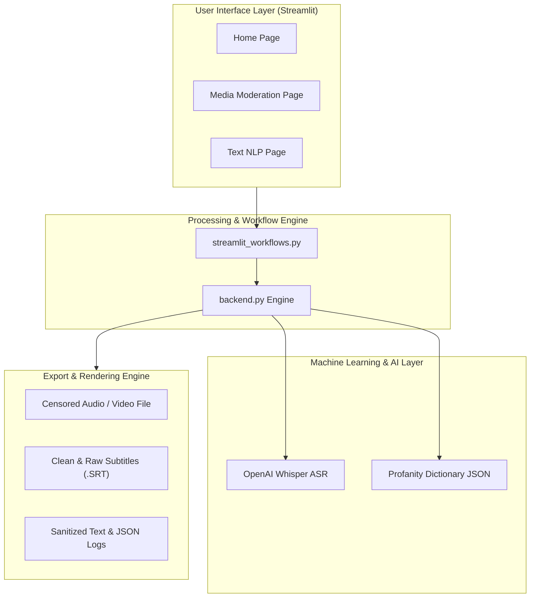

# Purity — AI Content Moderation & Profanity Cleaner

<p align="center">
  
  

  

  
</p>

---

## 📌 Executive Summary

**Purity (Profanity Cleaner)** is a state-of-the-art, multi-modal content moderation and sanitization engine. Built as a sleek web application powered by **Streamlit**, Purity automatically transcribes, detects, and redacts profanity across text documents, speech audio recordings, and video files.

Whether you are a content creator preparing videos for family-friendly platforms, a platform administrator moderating user comments, or a data analyst processing text corpora, Purity offers granular rule-based lexicography for text, audio, and video moderation.

---

## ✨ Key Features

### 🎧 1. Media Moderation & Speech Censoring
- **OpenAI Whisper ASR Integration**: High-precision speech-to-text transcription with timestamp alignment at word level.
- **Frame-Accurate Bleeping & Muting**: Mute audio intervals or overlay custom bleep sound effects (`Sine wave`, `Quack`, `Dolphin`, `Triggered`, or user-uploaded audio files).
- **Multi-Sound Audio Overlaying**: Layer multiple censor audio effects simultaneously with adjustable dB gain and looping controls.
- **Video & Audio Muxing**: Direct FFmpeg stream copying for video files (`.mp4`, `.mkv`, `.mov`, `.avi`, `.webm`) preserving original video streams while censoring audio tracks.
- **Automated Subtitle & Log Export**: Export synchronized raw and clean subtitle files (`.srt`), plain text transcripts (`.txt`), and timestamped JSON log data.

### 📝 2. Text NLP Moderation
- **Multi-Category Lexicon Filtering**: Categorizes profanity into 13 distinct severity classes (Invective, Anatomical, Insult, Slur, Obscenity, etc.).
- **Leet-Speak & Obfuscation Unmasking**: Decodes character substitution tricks (`f.u.c.k`, `sh!t`, `1diot`, `@ss`) and unicode obfuscations automatically.
- **Custom Whitelist & Blacklist Overrides**: Enforce mandatory censor words or grant exemptions for specific terms.
- **Rich Linguistic Metrics**: Real-time evaluation of word token count, profanity density, cleanliness scores, estimated reading time, and Part-of-Speech (POS) distribution.
- **Visual Highlighted Diff View**: Interactive HTML text viewer highlighting flagged profane tokens in context.

---

## 🏗️ System Architecture



---

## 💻 Tech Stack & Dependencies

| Category | Technology | Usage |
| :--- | :--- | :--- |
| **Frontend Framework** | `Streamlit` | Reactive web interface with custom CSS styling |
| **Speech Recognition** | `OpenAI Whisper` | Automatic Speech Recognition (ASR) with word timestamps |
| **Audio Processing** | `PyDub` & `FFmpeg` | Frame-level audio slicing, bleep overlaying, & video muxing |
| **Natural Language Processing** | `NLTK`, `better-profanity`, `joblib` | Lemmatization, POS tagging, dictionary matching |
| **Document Processing** | `python-docx` | Reading Microsoft Word documents (.docx) |

---

## 📁 Repository Structure

```
Purity/
├── app_streamlit.py             # Main Streamlit web application entry point
├── backend.py                   # Lower-level audio/video processing & FFmpeg engine
├── streamlit_workflows.py       # High-level workflow handlers & export formatters
├── profanity_dictionary.json    # Dictionary mapping terms to profanity categories
├── complete.mp3                 # Audio completion notification sound
├── dolphin.wav                  # Censor audio: Dolphin click sound effect
├── quack.wav                    # Censor audio: Duck quack sound effect
├── triggered.wav                # Censor audio: Triggered sound effect
├── packages.txt                 # Linux system packages for Streamlit Cloud (FFmpeg)
└── requirements.txt             # Python package dependencies
```

---

## 🚀 Getting Started

### Prerequisites

1. **Python 3.9+** installed on your system.
2. **FFmpeg** installed and added to your system `PATH`.
   - **Windows**: Install via `choco install ffmpeg` or download from [ffmpeg.org](https://ffmpeg.org/).
   - **Linux**: `sudo apt-get install ffmpeg`
   - **macOS**: `brew install ffmpeg`

### Installation

1. **Clone the repository**:
   ```bash
   git clone https://github.com/engmohammedsobhy/profanity-cleaner.git
   cd profanity-cleaner
   ```

2. **Create a virtual environment (recommended)**:
   ```bash
   python -m venv venv
   # On Windows:
   venv\Scripts\activate
   # On Linux/macOS:
   source venv/bin/activate
   ```

3. **Install dependencies**:
   ```bash
   pip install -r requirements.txt
   ```

---

## 🏃 Running the Application

Launch the Streamlit dashboard locally by running:

```bash
streamlit run app_streamlit.py
```

Open your web browser and navigate to `http://localhost:8501`.

---

## 📜 Usage Workflows

### Moderating Video / Audio Files
1. Navigate to **Media Moderation** from the sidebar navigation.
2. Drag and drop your audio (`.mp3`, `.wav`, `.m4a`) or video file (`.mp4`, `.mkv`, `.mov`, `.avi`).
3. Select your desired **Whisper ASR Model** size (Tiny, Base, Small, Medium, Large).
4. Choose the censoring style: `Silence`, `One sound`, or `Multiple sounds`.
5. Adjust optional timing controls (Time padding, Overlap audio, Censor volume).
6. Click **Start Media Processing** and download the sanitized file and subtitle transcripts (`.srt`).

### Moderating & Analyzing Text
1. Navigate to **Text NLP Moderation**.
2. Type/paste text into the input box OR upload a `.txt` / `.docx` file OR upload media to extract speech.
3. Configure replacement style (`****`, `F***`, or custom mask).
4. Click **Start Text Processing** to view detailed NLP statistics, POS breakdown, and copy/download cleaned outputs.

---

## 🛡️ License

This project is licensed under the **MIT License**.

Developed with ❤️ for safe digital communication.
